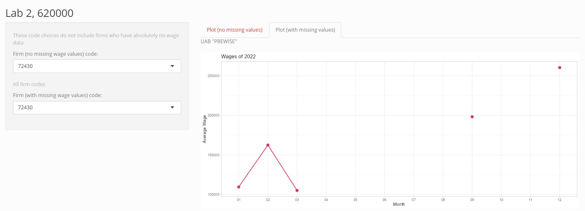

# R Laboratorinis darbas: duomenų vizualizacija

| Variantas | ecoActCode |
|-----------|------------|
| 19        | 620000     |

### 1. Užduotis

Atsakymas:

Išvados: Vidutinis metinis atlyginimas siekia 250000 eurus, o aukščiausias metinis atlyginimas viršija 1,5 mil. eurų.

### 2. Užduotis

Atsakymas:

Išvados: Penkių aukščiausią vidutinį metinį atlyginimą siekiančių įmonių atlyginimai beveik visada siekė bent 250000 eur. Įmonėje „MICROSOFT LIETUVA" atlyginimai ženkliai pakilo liepos mėnesį ir krito rugsėjį.

### 3. Užduotis

Atsakymas:

Išvados: Iš penkių geriausiai apmokamų įmonių, daugiausia apdrasutų darbuotojų yra „UAB RAILSBANK TECHNOLOGY".

### 4. Užduotis

Shiny R aplikacijos nuotrauka:

 
